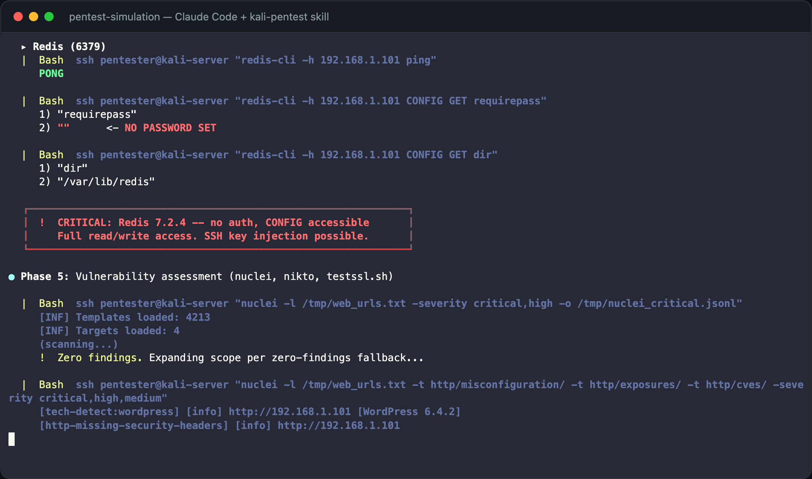
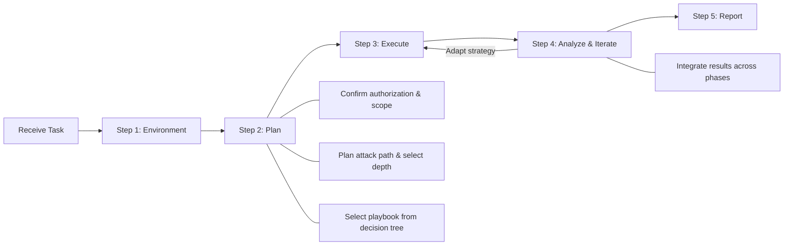
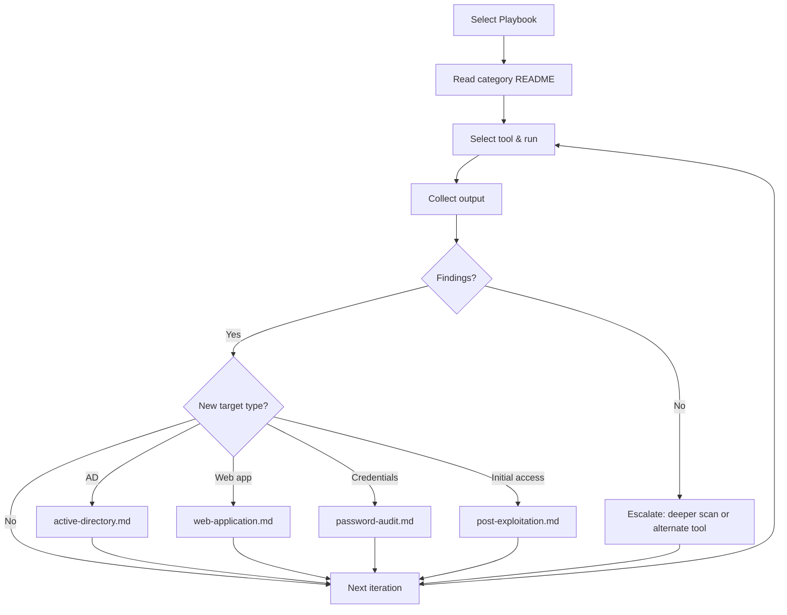

English | [简体中文](README.zh.md)

# kali-pentest

A penetration testing skill built on Kali Linux for AI agents such as Claude Code, OpenClaw, and Hermes Agent. Currently includes 269 CLI tools across 14 categories. Built-in coverage matrices, zero-findings fallbacks, and objective stopping conditions for each scenario ensure testing depth.

Unlike traditional automated penetration testing tools, the AI agent connects to a Kali environment via SSH or Docker, then autonomously plans the attack path based on the target, selects tools, integrates and analyzes results across phases to adapt the penetration strategy, and produces a structured report — with mandatory authorization checks and human approval gates for high-risk actions.

> [!WARNING]
> **Authorized Use Only** — This project is intended solely for authorized penetration testing, security research, and educational purposes. Always obtain explicit written permission before testing any target. Unauthorized access to computer systems is illegal.

---

## Demo

A simulated end-to-end penetration test with mock data.

**Targets**: 192.168.1.101 (Ubuntu 24 — 8 services) + 192.168.1.102 (Windows Server 2022 — 8 services).

Initial phases — connectivity verification, host discovery, and port scanning:


Deep testing phase — vulnerability detection and zero-findings fallback:


**Attack chain discovered**: Redis no-auth → SSH shell → SUID privesc → root → path traversal reads MSSQL creds → xp_cmdshell → credential reuse → domain admin → secretsdump

<a href="https://x-glacier.github.io/kali-pentest/demo/player.html">
<picture>
  
</picture>
</a>

Open [`demo/player.html`](https://x-glacier.github.io/kali-pentest/demo/player.html) in a browser to watch the recording with the asciinema player. Or play from the command line:

```bash
# Install asciinema if needed: pip install asciinema
asciinema play demo/pentest-simulation.cast
```

**Report attachments**:
- [`demo/simulation-report.md`](https://x-glacier.github.io/kali-pentest/demo/simulation-report.md) — Full Markdown report with evidence, reproduction steps, and remediation
- [`demo/simulation-report.html`](https://x-glacier.github.io/kali-pentest/demo/simulation-report.html) — Beautified HTML report (dark theme, attack chain diagram, severity badges)

---

## Workflow

### Overall Workflow



### Execution Detail (Step 3)



---

## Getting Started

### 1. Install the skill

Copy the skill directory into your AI agent's skills folder:

```bash
cp -r kali-pentest /path/to/your/agent/skills/kali-pentest
```

| Agent | Skills path |
|---|---|
| Claude Code | `~/.claude/skills/` (personal) or `.claude/skills/` (project) |
| OpenClaw | `~/.openclaw/skills/` |
| Hermes Agent | `~/.hermes/skills/` |

### 2. Provide Kali access

The agent needs a Kali Linux environment. Three options:

- **Local mode**: the agent runs directly on a Kali system — tools are invoked via bash without SSH or Docker overhead. Ideal when the AI agent itself is running on a Kali host.  
    Documentation: [Kali installation guide](https://www.kali.org/docs/installation/), [Local mode guide](kali-pentest/references/environment/local-mode.md).

- **Server mode (preferred for remote)**: full Kali over SSH — avoids Docker networking, raw-socket, wireless, and GPU limitations.  
    Documentation: [Kali installation guide](https://www.kali.org/docs/installation/), [Server mode guide](kali-pentest/references/environment/server-mode.md).

- **Docker mode**: pre-build a persistent container with tools installed. Best for CLI information gathering, vulnerability scanning, web/API and cloud-native testing, and reporting.  
    Documentation: [Kali Docker guide](https://www.kali.org/docs/containers/using-kali-docker-images/), [Docker mode guide](kali-pentest/references/environment/docker-mode.md).

Tell the agent how to connect:

```
Kali tools are available locally (this machine is Kali).
```

Or use a remote Kali server (SSH key recommended):

```
Kali server: ssh -i ~/.ssh/kali_key root@192.168.1.100
```

Or use Docker locally:

```
The persistent Docker container `kali-pentest` is initialized with the full toolset.
```

*For OpenClaw and similar AI assistants, you can also configure Kali connection details in TOOLS.md so the agent reads them automatically without asking each time.*

### 3. Invoke

Use natural language to assign a penetration testing task. The agent confirms scope and proceeds autonomously.

**Slash command**:

For Claude Code and compatible agents.
```
/kali-pentest
```

**Conversational**:

For OpenClaw, Hermes Agent, and other AI assistants.

### Tested Models

The skill workflow has been optimized and tested with:

- `claude-opus-4.6`
- `claude-sonnet-4.6`
- `deepseek-v4-pro`
- `qwen3.6:27b` — local fallback for air-gapped environments (requires context length ≥ 128K)

---

## Usage Examples

The agent supports three testing depths — **Quick** (fast check), **Standard** (default), and **Deep** (maximum coverage). Control it with natural language in your task description:

| Phrase in your prompt | Depth |
|---|---|
| "quick scan", "fast check" | Quick |
| *(no qualifier)* | Standard |
| "full assessment", "comprehensive", "deep" | Deep |

**Example 1** (Quick) — "quickly scan":

```
Kali tools are available locally (this machine is Kali).
Target: 10.0.0.0/24
Quickly scan the target network for open ports along with their service/protocol names and versions, then produce a report.
I have authorization.
```

**Example 2** (Standard) — no depth qualifier:

```
The persistent Docker container `kali-pentest` is initialized with the full toolset.
Use Docker mode to run a web application penetration test against http://192.168.1.50 and produce a detailed report.
I have authorization.
```

**Example 3** (Deep) — "in-depth":

```
Kali server: ssh -i ~/.ssh/kali_key root@192.168.1.100
First run a full port scan and service fingerprinting against 192.168.1.50, then plan and execute an in-depth penetration test based on the results — do not overlook any potential weakness. After testing, produce a detailed report.
I have authorization.
```

> [!TIP]
> A thorough, deep penetration test may require multiple conversation turns to complete. If the agent finishes too early or coverage is insufficient, you can point out the issue directly, or follow up with:
> - "Did you fully utilize Kali Linux tools during the penetration test?"
> - "Are the current pentest results comprehensive and deep enough?"
> - "Check the playbook's Stop When conditions — have all checklist items been satisfied?"

<details>
<summary>More examples (API, cloud, mobile, wireless, source code, VoIP/ICS)</summary>

```
Target domain: corp.example.com, domain controller 10.0.0.5
Perform an Active Directory security assessment covering enumeration, Kerberoasting, ACL abuse, and certificate template checks.
```

```
Target API: https://api.example.com, OpenAPI spec at /tmp/openapi.yaml
Perform an API security assessment covering authentication, authorization, and schema-driven testing.
```

```
Target: Kubernetes cluster context prod-audit and container registry registry.example.com
Run a read-only cloud-native security assessment and produce a findings report.
```

```
Target app: /tmp/app.apk with test account user@example.com
Perform an Android application security assessment, including static analysis, runtime checks, and backend endpoint mapping.
```

```
Authorized SSID: CorpWiFi, BSSID: AA:BB:CC:DD:EE:FF, channel 6
Perform a wireless security assessment including passive discovery, handshake capture, WPS detection, and evil twin testing.
```

```
Target repository: /tmp/source-repo (including Git history)
Perform a source code and dependency audit including secret scanning, SAST, and CI/CD pipeline security checks.
```

```
Target: SIP service 10.10.20.15 and Modbus host 10.10.30.20
Conservative read-only VoIP/ICS protocol assessment. Do not place calls or write PLC/Modbus values.
```

</details>

---

## Architecture

### Directory Structure

```
demo/                          ← Simulation recording and report attachments
├── pentest-simulation.cast    ← asciicast v2 recording
├── player.html                ← Browser-based asciinema player
├── simulation-report.md       ← Full Markdown report
└── simulation-report.html     ← Beautified HTML report

kali-pentest/
├── SKILL.md                   ← Agent entry point: planning, execution, error handling
└── references/
    ├── playbooks/             ← 16 scenario workflows (AD, web, internal, cloud, wireless, ...)
    ├── environment/           ← Server mode and Docker mode setup
    ├── information-gathering/ ← 48 tools
    ├── vulnerability/         ← 17 tools
    ├── sniffing-spoofing/     ← 10 tools
    ├── web/                   ← 38 tools
    ├── exploitation/          ← 24 tools
    ├── password/              ← 21 tools
    ├── wireless/              ← 27 tools
    ├── cloud-native/          ← 8 tools
    ├── rfid-nfc/              ← 5 tools
    ├── voip-ics/              ← 8 tools
    ├── reverse-engineering/   ← 17 tools
    ├── forensics/             ← 23 tools
    ├── post-exploitation/     ← 22 tools
    └── reporting/             ← 1 tool + report template
```

The `kali-pentest-zh/` directory is the Chinese mirror and stays structurally synchronized with `kali-pentest/`.

### Document Layering

The skill uses a four-layer document hierarchy. Each layer has a distinct responsibility, and the agent reads top-down:

| Layer | Files | Responsibility |
|-------|-------|----------------|
| Entry point | `SKILL.md` | Global workflow (Steps 1–5), execution standards, general testing principles |
| Scenario workflows | `playbooks/*.md` | Phase-by-phase procedures, decision trees, concrete command pipelines, depth-enforcement directives, stopping conditions |
| Tool selection | `<category>/README.md` | Category overview, tool comparison, selection guidance |
| Tool reference | `<category>/tools/<name>.md` | Parameters, command examples, installation, notes, official links |

General principles live in `SKILL.md` (brief, no code blocks). Scenario-specific implementations live in playbooks (concrete commands, test matrices, coverage requirements). The layered structure prevents duplication while ensuring both global coverage and per-scenario depth.

### Depth Enforcement

Each playbook includes bold-labeled directives at key workflow decision points to prevent the agent from doing shallow, surface-level work:

- **Coverage requirements** — test ALL discovered items (endpoints, services, credentials), not just a sample.
- **Zero-findings fallback** — escalate or manually verify when automated tools report no findings.
- **Coverage matrices** — build explicit item × test matrices and complete every cell.
- **Attack escalation** — progress through multiple attack techniques of increasing depth.

Every playbook has objective, verifiable stopping conditions — not "testing is complete" but specific artifacts, matrices, and checklists that must be filled. Every confirmed finding must include the complete reproducible command and its actual output as evidence.

### Cross-Reference Logic

Playbooks form a connected graph. When a workflow phase discovers targets that belong to a different scenario (e.g., AD signals during internal network scanning, API endpoints during web testing), the playbook directs the agent to switch. All such handoffs are listed in each playbook's `Cross-References` section.

Reusable methodology (e.g., the scanning procedures in `internal-network.md` and protocol enumeration in `internal-network-protocols.md`) can be referenced from other playbooks.

### Playbooks

16 scenario workflows with phases, decision trees, risk gates, and stopping conditions:

| Playbook | Scenario |
|---|---|
| `internal-network.md` | Host discovery, port scanning, service enumeration, pivoting |
| `internal-network-protocols.md` | SMB, MSRPC, SNMP, SMTP, DNS, database, RDP protocol-specific enumeration |
| `external-attack-surface.md` | OSINT, subdomain enumeration, exposed service scanning |
| `web-application.md` | OWASP Top 10, CMS, injection, auth, business logic |
| `api-security.md` | REST, GraphQL, gRPC, WebSocket, JWT, BOLA/IDOR |
| `active-directory.md` | Kerberoasting, ADCS, relay, ACL abuse, DCSync |
| `password-audit.md` | Hash cracking, spraying, credential reuse, capture |
| `wireless-assessment.md` | WPA/WPA3, WPS, evil twin, Bluetooth/BLE |
| `cloud-native-assessment.md` | AWS/Azure/GCP IAM, Kubernetes, containers, serverless |
| `mobile-application.md` | Android/iOS static + dynamic analysis, SSL pinning bypass |
| `post-exploitation.md` | Privilege escalation, lateral movement, persistence, C2 |
| `forensics-triage.md` | Disk imaging, memory forensics, log analysis, steganography |
| `rfid-nfc.md` | NFC/RFID cloning, smart cards, firmware extraction |
| `voip-ics.md` | VoIP/SIP, ICS/OT/Modbus, IPMI/BMC (safety-first) |
| `source-code-audit.md` | Secret scanning, SAST, dependency audit, CI/CD checks |
| `reporting-workflow.md` | Evidence packaging, CVSS scoring, report generation |

### Tool Selection Criteria

All tools are selected for autonomous agent operation:

- **CLI-automatable only** — GUI-only tools and interactive debuggers are excluded
- **Headless binary analysis included** — `strings`, `checksec`, `radare2` one-shot, Ghidra Headless
- **CLI alternatives preferred** — e.g., `tshark` instead of Wireshark

---

## Disclaimer

This project is provided as-is for educational purposes and authorized security testing. Users are solely responsible for obtaining written authorization and complying with applicable laws and regulations. The authors assume no liability for damage caused by this project.

## Vulnerability Disclosure

Security vulnerabilities discovered during authorized testing must be reported privately to the asset owner through agreed-upon channels. Do not publicly disclose vulnerability details before the owner has had reasonable time to remediate. Follow [responsible disclosure](https://en.wikipedia.org/wiki/Responsible_disclosure) practices and any coordinated disclosure agreements in your engagement scope.

## Contributing

Issues and pull requests are welcome.
